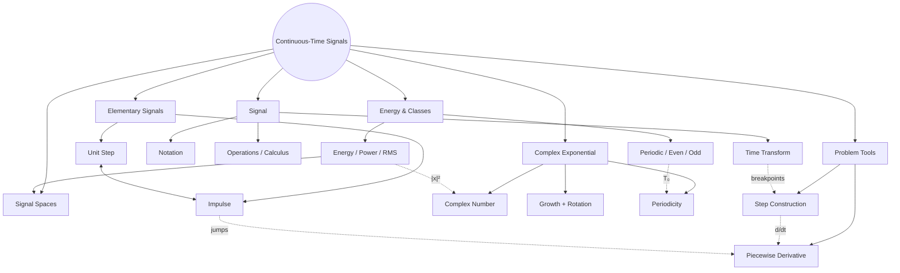
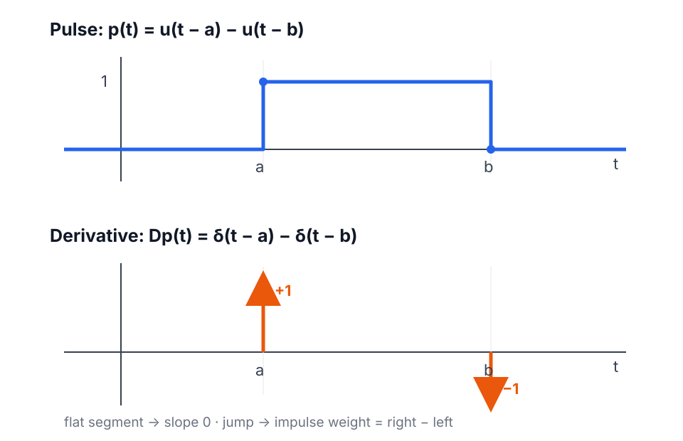
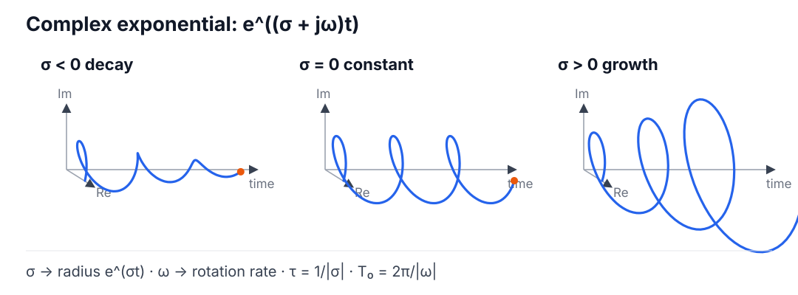
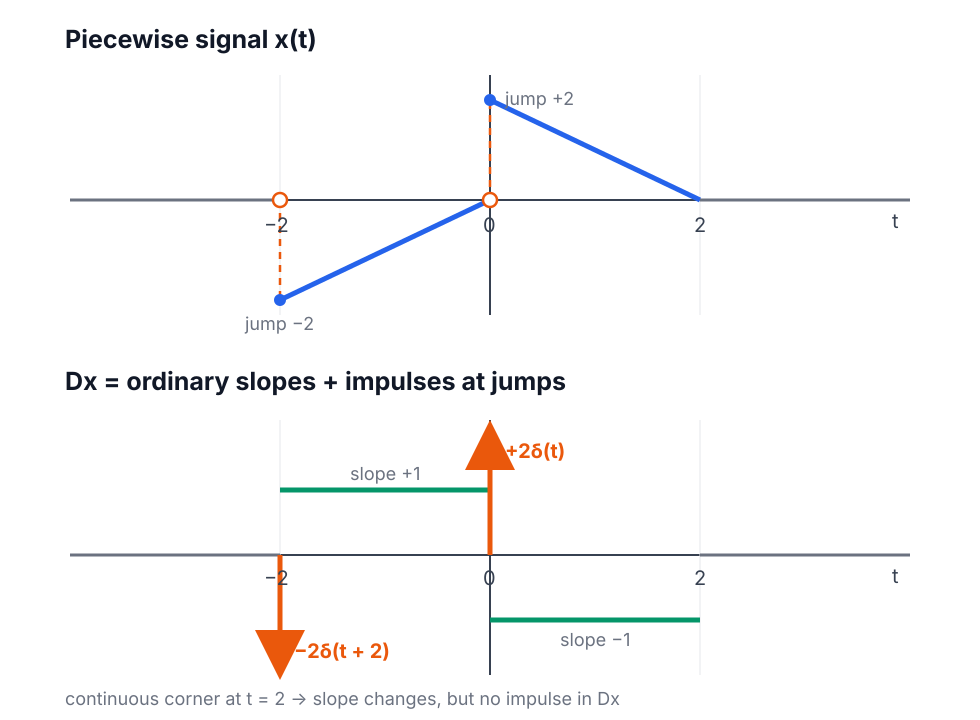

<!-- AI-assisted draft: Signals_and_System_02Oct.pdf, Chapter 2, pp. 25-41 + user discussion. -->

# Chapter 2 — Continuous-Time Signals

Signals_and_System_02Oct.pdf · pp. 25-41

---

## Map

Jump: [Signal](#signal) · [Energy & classes](#energy-classes) · [Elementary signals](#elementary-signals) · [Complex exponential](#complex-exponential) · [Problem tools](#problem-tools) · [Signal spaces](#signal-spaces)

---

## Signal

**Notation**

$$
x:\mathbb R\to\mathbb R
\qquad\text{or}\qquad
x:\mathbb R\to\mathbb C
$$

- $x$: whole signal
- $x(t)$: value at $t$
- domain: allowed inputs
- codomain: allowed outputs
- range: actual outputs

$$
\mathrm{range}(x)\subseteq\mathrm{codomain}(x)
$$

Symbols: $\forall$ all · $\exists$ exists · $\in$ belongs · $:$ such that.

Sound: magnitude ↔ volume · time scale ↔ pitch · $x(-t)$ ↔ reverse.

**Operations / calculus**

$$
(cx)(t)=cx(t),\qquad
(x+y)(t)=x(t)+y(t),\qquad
(xy)(t)=x(t)y(t)
$$

$$
\dot x(t)=\frac{dx}{dt}(t)
$$

$$
y(t)=\int_{-\infty}^{t}x(\tau)\,d\tau
$$

- $\tau$: dummy variable
- $t$: observation time
- variable limit → signal
- fixed limits → number

$t\in\mathbb R$: any real $t$; not $t=\infty$.

↔ [energy](#energy) · [step/impulse](#elementary-signals)

Practice: [positive $f$ vs increasing $g$](./chapter-2-representative-problems.md#p1-positive-vs-increasing)

**Time transform**

$$
\boxed{x_{a,t_0}(t)=x\!\left(a(t-t_0)\right)}
$$

Original point $\tau$:

$$
\boxed{t=t_0+\frac{\tau}{a}}
$$

- $|a|>1$: narrower
- $0<|a|<1$: wider
- $a<0$: reversal
- $t_0>0$: right
- $t_0<0$: left

Method: breakpoints $\tau$ → transform → sort → same heights.

↔ [problem tools](#problem-tools)

Practice: [breakpoint transform](./chapter-2-representative-problems.md#p3-time-transform)

---

## Energy & Classes

**Energy / power / RMS**

Circuit origin:

$$
p(t)=\frac{v^2(t)}{R},
\qquad
E(t)=\int_{-\infty}^{t}\frac{v^2(\tau)}{R}\,d\tau
$$

$$
\boxed{E_\infty=\int_{-\infty}^{\infty}|x(t)|^2dt}
$$

$$
E_\infty<\infty
\iff
\text{finite energy}
$$

$\infty$: whole time axis; not necessarily infinite answer.

$$
\boxed{
P_\infty=
\lim_{T\to\infty}
\frac{1}{2T}\int_{-T}^{T}|x(t)|^2dt
}
$$

$$
x_{\mathrm{RMS}}=\sqrt{P_\infty}
$$

$$
E_\infty<\infty\Rightarrow P_\infty=0
$$

Checks:

- bounded $x$ $\nRightarrow$ finite energy
- complex: $|x|^2=xx^*$
- even integrand: $\int_{-A}^{A}f=2\int_0^A f$

↔ [complex-number tools](#complex-number) · [periodic power](#classes)

Practice: [energy / power / RMS](./chapter-2-representative-problems.md#p2-energy-power-rms) · [impulse → energy](./chapter-2-representative-problems.md#p5-impulse-step-energy)

**Periodic / aperiodic**

$$
\mathcal P=
\{T>0:x(t+T)=x(t),\ \forall t\in\mathbb R\}
$$

$$
\boxed{T_0=\min\mathcal P}
$$

Constant signal: every $T>0$ works → no smallest $T$ → no $T_0$.

Aperiodic: $\mathcal P=\varnothing$.

Nonzero periodic signal:

$$
E_\infty=\infty
$$

$$
P_\infty=
\frac{1}{T_0}
\int_{t_0}^{t_0+T_0}|x(t)|^2dt
$$

$$
A\cos(\omega t+\phi):
\qquad
P_\infty=\frac{A^2}{2}
$$

$$
Ae^{j(\omega t+\phi)}:
\qquad
P_\infty=|A|^2
$$

**Even / odd**

$$
x(t)=x(-t)
\qquad\text{even}
$$

$$
x(t)=-x(-t)
\qquad\text{odd}
$$

$\cos$: even · $\sin$: odd.

$$
f\text{ odd}
\Rightarrow
\int_{-A}^{A}f(t)\,dt=0
$$

↔ [complex periodicity](#complex-periodicity)

Practice: [$\sigma$ vs periodicity](./chapter-2-representative-problems.md#p4-complex-periodicity)

---

## Elementary Signals

**Unit step**

$u$: Heaviside step.

$$
u(t)=
\begin{cases}
0,&t<0\\
1,&t\ge0
\end{cases}
$$

$$
u(t-a):\text{ open at }a
\qquad
u(a-t):\text{ close at }a
$$

$$
x(t)u(t-a):
\text{ keep }t\ge a
$$

Pulse $[a,b)$:

$$
\boxed{u(t-a)-u(t-b)}
$$

Also:

$$
u(t-a)u(b-t)
$$

Endpoint only: depends on $u(0)$.

Course: $u(0)=1$; single-point choice does not change ordinary integrals.

↔ [impulse](#impulse) · [step construction](#step-construction)

Practice: [two-step pulse](./chapter-2-representative-problems.md#p6-pulse-forms) · [level changes](./chapter-2-representative-problems.md#p7-step-construction)

**Dirac delta**

$$
\delta_n(t)=
\begin{cases}
n,&|t|\le\dfrac{1}{2n}\\
0,&\text{otherwise}
\end{cases}
,qquad
\int_{-\infty}^{\infty}\delta_n(t)dt=1
$$

$n\to\infty$: width $\to0$ · height $\to\infty$ · area $=1$.

$$
\int_{-\infty}^{\infty}\delta(t-a)\,dt=1
$$

Not an ordinary pointwise function.

Sifting:

$$
\boxed{
\int_{-\infty}^{\infty}f(t)\delta(t-a)\,dt=f(a)
}
$$

$$
\boxed{f(t)\delta(t-a)=f(a)\delta(t-a)}
$$

$$
\boxed{
\delta\!\left(c(t-a)\right)
=\frac{1}{|c|}\delta(t-a)
}
$$

$1/|c|$: preserve unit area.

Step ↔ impulse:

$$
\boxed{
u(t-a)=\int_{-\infty}^{t}\delta(\tau-a)\,d\tau
}
$$

$$
\boxed{
\frac{d}{dt}u(t-a)=\delta(t-a)
}
$$

Future:

$$
\int_T^\infty\delta(t-a)\,dt=u(a-T)=u(-(T-a))
$$

Impulse arrow: position $a$ · label $=$ weight/area.

↔ [calculus](#operations) · [piecewise derivative](#piecewise-derivative)

Practice: [impulse → step → energy](./chapter-2-representative-problems.md#p5-impulse-step-energy) · [delta properties](./chapter-2-representative-problems.md#p9-delta-properties)

---

## Complex Exponential

**Complex-number tools**

$$
z=x+jy=re^{j\theta}
$$

$$
r=|z|=\sqrt{x^2+y^2},
\qquad
\theta=\mathrm{atan2}(y,x)
$$

$$
z^*=x-jy,
\qquad
\boxed{|z|^2=zz^*}
$$

$$
|e^{j\theta}|=1
$$

**Signal**

$$
s=\sigma+j\omega
$$

ODE building block.

$$
\boxed{
e^{st}
=
e^{\sigma t}
\left[\cos(\omega t)+j\sin(\omega t)\right]
}
$$

- $\sigma$: magnitude growth/decay
- $\omega$: rotation/oscillation

$$
|e^{st}|=e^{\sigma t},
\qquad
\angle e^{st}=\omega t
$$

$$
\tau=\frac{1}{|\sigma|}
$$

$\sigma<0$: $e^{\sigma\tau}=e^{-1}$ · $\sigma>0$: $e^{\sigma\tau}=e$.

$$
f=\frac{|\omega|}{2\pi},
\qquad
T_0=\frac{2\pi}{|\omega|}
$$

$$
\cos(\omega t)=\frac{e^{j\omega t}+e^{-j\omega t}}{2}
$$

$$
\sin(\omega t)=\frac{e^{j\omega t}-e^{-j\omega t}}{2j}
$$

$\sigma<0$: inward spiral · $\sigma=0$: circle · $\sigma>0$: outward spiral.

Practice: [complex magnitude / power](./chapter-2-representative-problems.md#p2-energy-power-rms) · [$\sigma$ vs constant magnitude](./chapter-2-representative-problems.md#p4-complex-periodicity)

**Periodicity**

$$
Ae^{(\sigma+j\omega)t}
\text{ periodic}
\iff
A\ne0,\ \sigma=0,\ \omega\ne0
$$

$$
T_0=\frac{2\pi}{|\omega|}
$$

$$
Ae^{c+j\omega t}
=Ae^c e^{j\omega t}
\quad\text{periodic}
$$

$$
Ae^{(c+j\omega)t}
=Ae^{ct}e^{j\omega t}
\quad\text{not periodic if }c\ne0
$$

Sinusoid sum:

$$
\frac{\omega_i}{\omega_j}\in\mathbb Q
\quad\forall i,j
$$

then common $T_0$ exists.

↔ [periodic signals](#classes) · [energy](#energy)

---

## Problem Tools

**Piecewise constant → steps**

At $t_k$:

$$
J_k=\text{new level}-\text{old level}
$$

$$
\boxed{x(t)=\text{initial level}+\sum_kJ_ku(t-t_k)}
$$

↔ [unit step](#step) · [derivative](#piecewise-derivative)

Practice: [level-change method](./chapter-2-representative-problems.md#p7-step-construction)

**Piecewise derivative**

$$
\boxed{
Dx=
x'_{\mathrm{ordinary}}
+
\sum_k
\left[x(t_k^+)-x(t_k^-)\right]\delta(t-t_k)
}
$$

- sloped segment → ordinary slope
- constant segment → $0$
- jump → impulse
- continuous corner → no impulse in $Dx$

Reason:

$$
\int_{t_k-\varepsilon}^{t_k+\varepsilon}Dx(t)\,dt
\xrightarrow{\varepsilon\to0}
x(t_k^+)-x(t_k^-)
$$

Pulse:

$$
u(t-a)-u(t-b)
\xrightarrow{d/dt}
\delta(t-a)-\delta(t-b)
$$

↔ [step](#step) · [impulse](#impulse)

Practice: [rectangular pulse](./chapter-2-representative-problems.md#p6-pulse-forms) · [slopes + jumps](./chapter-2-representative-problems.md#p8-piecewise-derivative)

**Fast checks**

- $f(t)>0$ $\nRightarrow$ $f$ increasing
- $f\ge0$ and $g(T)=\int_{-T}^{T}f(t)dt$ → $g$ nondecreasing
- $|e^{j\theta}|=1$
- transform point: $t=t_0+\tau/a$
- jump weight: right $-$ left
- delta product: sample at impulse location
- energy: support → split → $|x|^2$ → integrate

---

## Signal Spaces

Impulse as functional:

$$
\delta:C_0\to\mathbb R,
\qquad
f\mapsto f(0)
$$

$C_0$: functions continuous at $0$.

$$
L^2=
\left\{
x:\int_{-\infty}^{\infty}|x(t)|^2dt<\infty
\right\}
$$

$$
E_\infty=\|x\|_2^2
$$

$$
L_e^2=
\left\{
x:\int_{-\infty}^{T}|x(t)|^2dt<\infty,\ \forall T
\right\}
$$

Real signals:

$$
\langle x,y\rangle=
\int_{-\infty}^{\infty}x(t)y(t)dt
$$

Complex signals:

$$
\langle x,y\rangle=
\int_{-\infty}^{\infty}x(t)y^*(t)dt
$$

Real nonzero signals:

$$
\cos\theta=
\frac{\langle x,y\rangle}{\|x\|_2\|y\|_2}
$$

$$
L^1=
\left\{
x:\int_{-\infty}^{\infty}|x(t)|dt<\infty
\right\}
$$

↔ [energy](#energy) · [complex modulus](#complex-number) · [map](#map)
