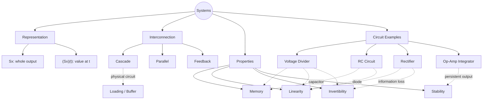
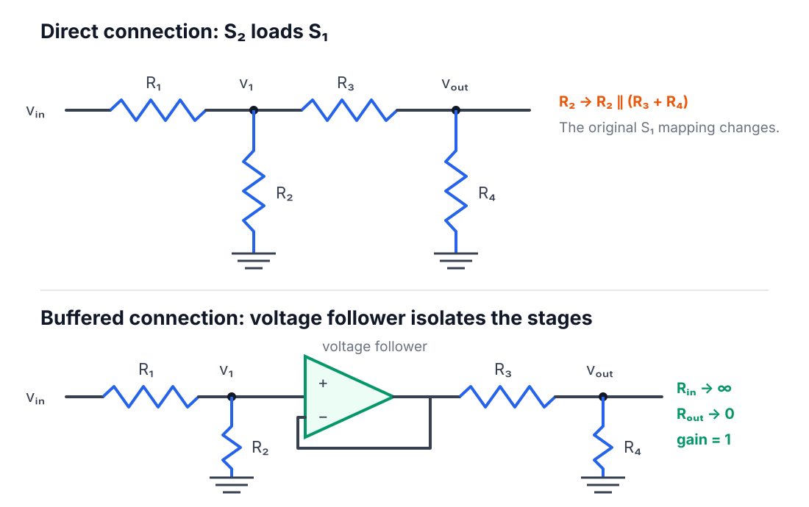
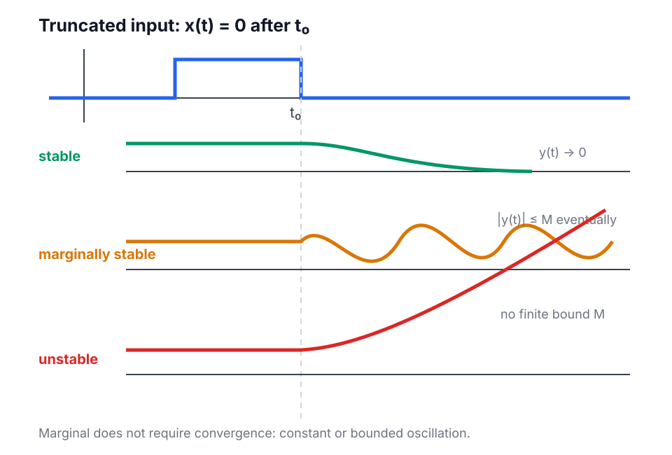

<!-- AI-assisted draft: Signals_and_System_02Oct.pdf, Chapter 3, pp. 45-53; SnS_Systems.pdf, slides 1-34; user discussion. -->

# Chapter 3 — Systems and Properties

Current scope: representation → interconnection → memory · linearity · invertibility · stability.

---

## Map

Jump: [System](#system) · [Interconnection](#interconnection) · [Properties](#properties) · [Circuits](#circuits) · [Fast checks](#fast-checks)

---

## System

$$
S:\mathcal X\to\mathcal Y,
\qquad
x\mapsto y=Sx
$$

$$
y(t)=(Sx)(t)
$$

- $x,y$: whole signals
- $Sx$: whole output signal
- $(Sx)(t)$: output value at $t$
- parameters + initial conditions: fixed parts of $S$

Basic systems:

$$
(Bx)(t)=x(-t)
\qquad\text{time reversal}
$$

$$
(Ix)(t)=\int_{-\infty}^{t}x(\tau)\,d\tau
\qquad\text{integration}
$$

$$
(Dx)(t)=\frac{dx}{dt}(t)
\qquad\text{differentiation}
$$

$$
(P_kx)(t)=kx(t)
\qquad\text{gain}
$$

---

## Interconnection

**Cascade**

$$
v=S_1x,
\qquad
y=S_2v
$$

$$
\boxed{S_{\mathrm c}=S_2\circ S_1}
$$

Right first. Composition; not multiplication.

**Parallel**

$$
\boxed{S_{\mathrm p}=S_1+S_2}
$$

$$
((S_1+S_2)x)(t)
=(S_1x)(t)+(S_2x)(t)
$$

**Feedback**

$$
e=x+\sigma S_2y,
\qquad
y=S_1e,
\qquad
\sigma\in\{-1,+1\}
$$

$$
y=S_1(x+\sigma S_2y)
$$

Well posed:

$$
\forall x,\ \exists!\,y
$$

One input → one unique output.

**Physical cascade: loading**

Isolated divider:

$$
v_1=\frac{R_2}{R_1+R_2}v_{\mathrm{in}}
$$

Second divider attached:

$$
R_2\longrightarrow R_2\parallel(R_3+R_4)
$$

$$
v_1=
\frac{R_2\parallel(R_3+R_4)}
{R_1+R_2\parallel(R_3+R_4)}v_{\mathrm{in}}
$$

Second stage changes first → block mappings not preserved.

Voltage follower:

$$
R_{\mathrm{in}}\to\infty,
\qquad
R_{\mathrm{out}}\to0,
\qquad
\text{gain}=1
$$

Isolation → valid cascade.

---

## Properties

**Memory**

Memoryless:

$$
x_1(t)=x_2(t)
\Rightarrow
(Sx_1)(t)=(Sx_2)(t)
$$

Pointwise form:

$$
(Sx)(t)=f(t,x(t))
$$

Time-independent case:

$$
(Sx)(t)=f(x(t))
$$

Gain:

$$
(P_kx)(t)=kx(t)
$$

Saturation:

$$
\mathrm{sat}_L(x)=
\begin{cases}
-L,&x<-L\\
x,&-L\le x\le L\\
L,&x>L
\end{cases}
$$

Has memory: depends on $x(\tau)$ for some $\tau\ne t$.

$$
x(t-1):\text{ past memory}
\qquad
x(t+1):\text{ future memory}
$$

Backward system:

$$
(Bx)(t)=x(-t)
$$

- $t<0$: reads future $-t>t$
- $t>0$: reads past $-t<t$
- overall: has memory

**Linearity**

$$
\boxed{
S(\alpha x_1+\beta x_2)
=\alpha Sx_1+\beta Sx_2
}
$$

Equivalent:

$$
S(x_1+x_2)=Sx_1+Sx_2,
\qquad
S(\alpha x)=\alpha Sx
$$

Fixed zero initial condition required for RC superposition.

$$
RC\frac{dv_{\mathrm{out}}}{dt}+v_{\mathrm{out}}=v_{\mathrm{in}}
$$

Memory $\ne$ nonlinearity:

- divider: linear · memoryless
- RC: linear · memory
- ideal rectifier: nonlinear · memoryless
- rectifier + capacitor: nonlinear · memory

**Invertibility**

$$
\boxed{
S^{-1}S=SS^{-1}=P_1
}
$$

$$
S^{-1}(Sx)=x,
\qquad
S(S^{-1}y)=y
$$

$$
(P_1x)(t)=x(t)
$$

Recovery requires one-to-one mapping:

$$
x_1\ne x_2
\quad\text{but}\quad
Sx_1=Sx_2
\Rightarrow
\text{not invertible}
$$

Gain:

$$
P_k^{-1}=P_{1/k},
\qquad k\ne0
$$

$$
P_0x=0\quad\forall x
\Rightarrow
\text{information lost}
$$

Half-wave rectifier:

$$
(Sx)(t)=\max\{0,x(t)\}
$$

All negative values $\mapsto0$ → not invertible.

Integrator / differentiator:

$$
DI=P_1
$$

$$
IDx=x-x(-\infty)
$$

$ID=P_1$ only with fixed $x(-\infty)=0$.

Practice: [information loss](./chapter-3-representative-problems.md#p1-invertibility) · [integration / differentiation](./chapter-3-representative-problems.md#p2-integration-differentiation)

**Finite-energy input-output stability**

$$
E_x=\int_{-\infty}^{\infty}|x(t)|^2dt
$$

$$
\boxed{
E_x<\infty
\Rightarrow
E_{Sx}<\infty
}
$$

Not required: $E_{Sx}<E_x$ · $y(t)\to$ constant · bounded amplitude alone.

Backward system:

$$
\begin{aligned}
E_{Bx}
&=\int_{-\infty}^{\infty}|x(-t)|^2dt\\
&=\int_{-\infty}^{\infty}|x(\tau)|^2d\tau\\
&=E_x
\end{aligned}
$$

Time reversal preserves area; not amplitude negation.

Rectifier:

$$
|Sx(t)|^2\le|x(t)|^2
\Rightarrow
E_{Sx}\le E_x
$$

**After switch-off**

Truncated input:

$$
\exists t_0:\quad x(t)=0,
\qquad \forall t>t_0
$$

$$
\begin{aligned}
y(t)\to0
&\quad\text{stable}\\
y(t)\not\to0,\ |y(t)|\le M\text{ eventually}
&\quad\text{marginally stable}\\
|y(t)|\text{ unbounded}
&\quad\text{unstable}
\end{aligned}
$$

Marginal: constant or bounded oscillation; convergence not required.

Two definitions: different tests; not equivalent in general.

Practice: [backward energy](./chapter-3-representative-problems.md#p3-backward-energy) · [marginal integrator](./chapter-3-representative-problems.md#p4-marginal-integrator) · [unstable modified integrator](./chapter-3-representative-problems.md#p5-modified-integrator)

---

## Circuit Links

**Voltage divider**

$$
v_{\mathrm{out}}(t)
=\frac{R_2}{R_1+R_2}v_{\mathrm{in}}(t)
$$

Gain · memoryless · linear · invertible if $R_2\ne0$ · finite-energy stable.

**RC circuit**

$$
E_C(t)=\frac12Cv_{\mathrm{out}}^2(t)
$$

Stored voltage → past information → memory.

Unit step, initially discharged:

$$
v_{\mathrm{out}}(t)=1-e^{-t/(RC)},
\qquad
\tau=RC
$$

$$
v_{\mathrm{out}}(\tau)=1-e^{-1}\approx0.632
$$

Pulse removed → exponential decay to $0$.

**Rectifier + capacitor**

Diode switching → nonlinear · capacitor voltage → memory.

**Ideal op-amp integrator**

$$
v_-=v_+=0,
\qquad
i_-=0
$$

$$
\frac{v_{\mathrm{in}}(t)}{R}
=-C\frac{dv_{\mathrm{out}}}{dt}
$$

$$
\boxed{
v_{\mathrm{out}}(t)
=-\frac1{RC}\int_{-\infty}^{t}v_{\mathrm{in}}(\tau)d\tau
}
$$

Pulse:

$$
v_{\mathrm{in}}(t)=
\begin{cases}
1\ \mathrm V,&0\le t<RC\\
0,&\text{otherwise}
\end{cases}
$$

$$
E_{\mathrm{in}}=(1\ \mathrm V)^2RC<\infty
$$

After $RC$:

$$
v_{\mathrm{out}}(t)=-1\ \mathrm V
\Rightarrow
E_{\mathrm{out}}=\infty
$$

Finite-energy unstable · truncated-input marginally stable.

Practice: [op-amp integrator](./chapter-3-representative-problems.md#p6-op-amp-integrator)

---

## Fast Checks

- $S_2S_1$: $S_1$ first
- block cascade $\ne$ automatic physical cascade
- capacitor / inductor → likely memory
- diode switching → likely nonlinear
- information loss → not invertible
- $k=0$: many inputs → zero
- $D(Ix)=x$; $I(Dx)=x-$ initial value
- finite energy $\ne$ bounded amplitude
- truncated: input permanently off after $t_0$
- marginal: bounded; not necessarily constant
- one counterexample defeats “for every input” stability

[Representative problems](./chapter-3-representative-problems.md)
